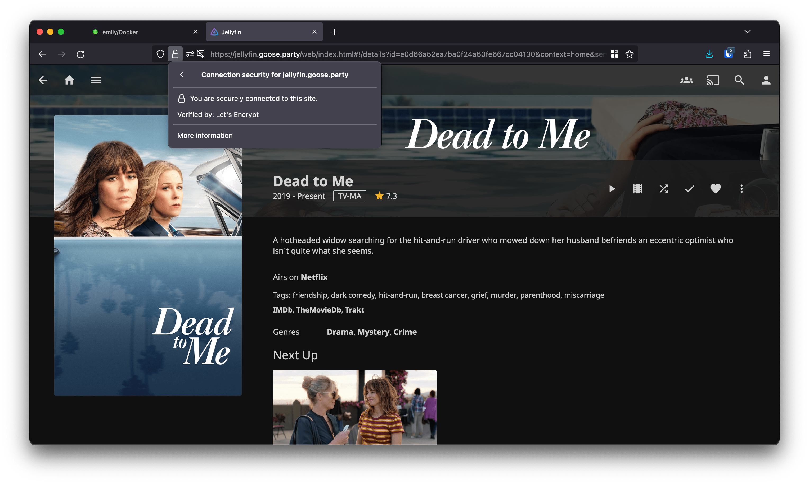
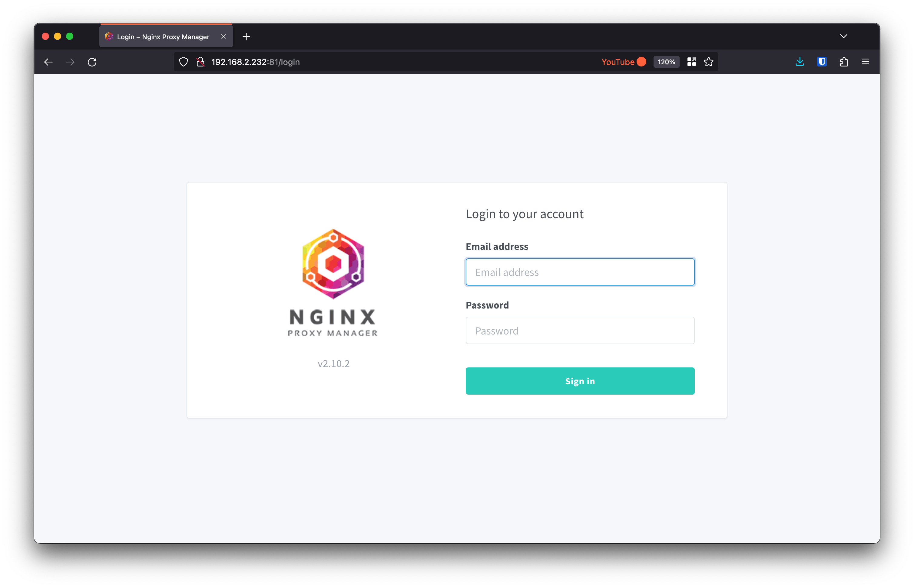
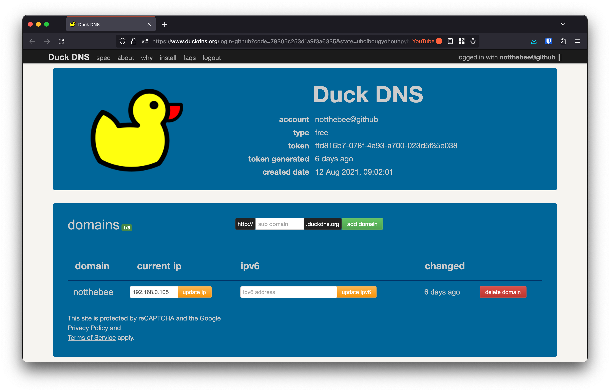
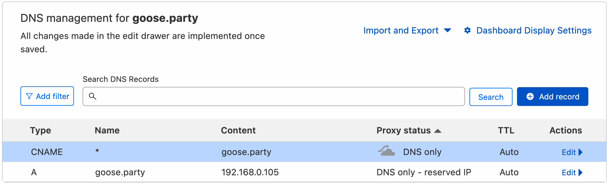
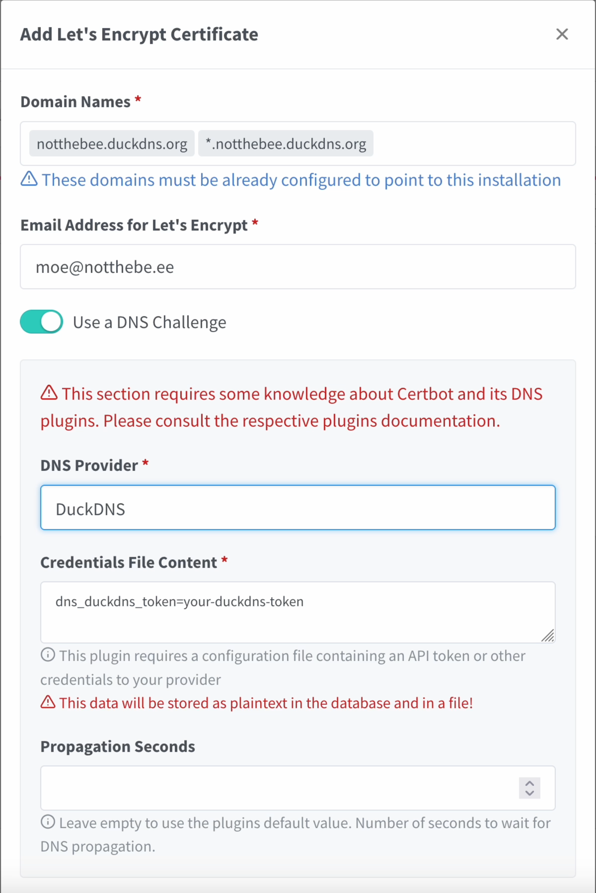
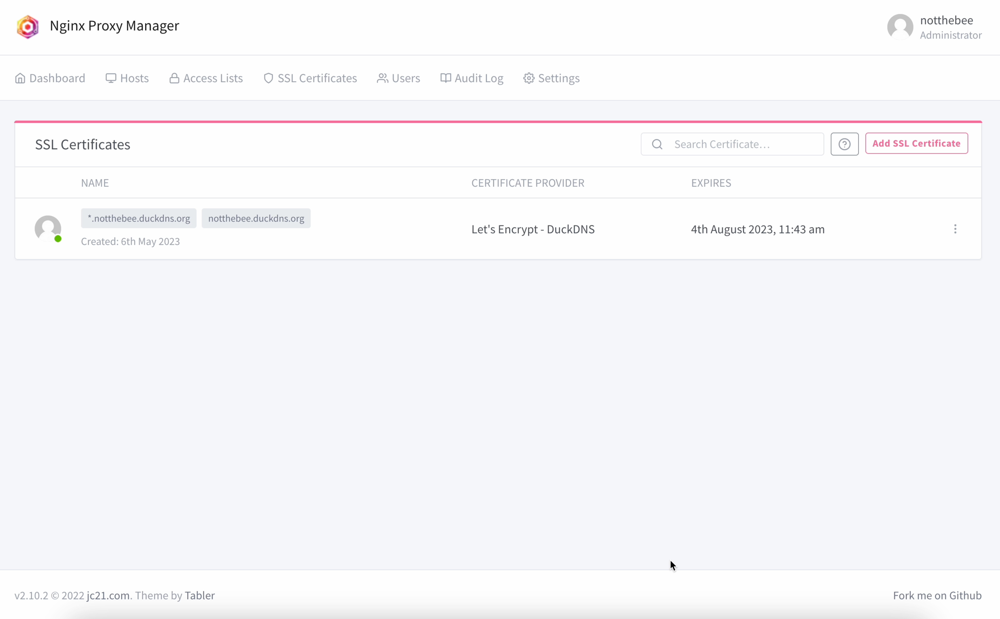
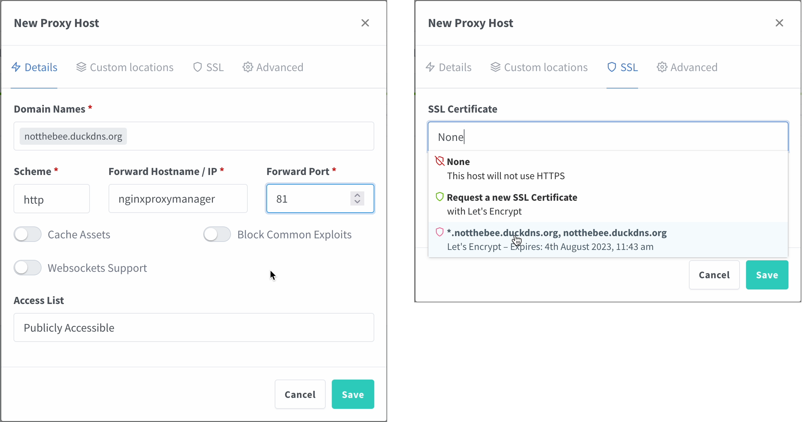
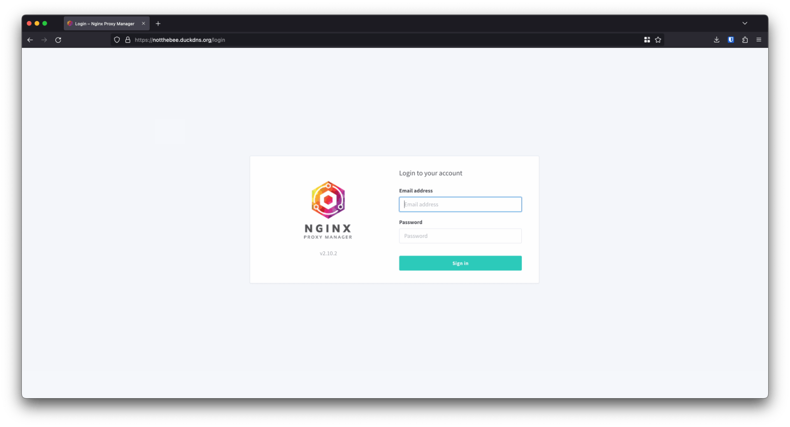

+++
title = "Easy, quick and free valid SSL certificates for your homelab (using DuckDNS and ACME DNS-01)" +++



If you're running local web applications in your homelab, chances are, you're accessing them with a combination of an IP address and a port (e.g. `http://192.168.1.32:8096` for Jellyfin).

However, at some point, you might get tired of memorizing IP addresses, so you'll switch to a combination of a reverse proxy and local domain names, such as `https://jellyfin.local` or `https://homeassistant.local`.

After doing that, you'll quickly notice that you get a browser warning every time you visit your applications. Annoying.

So what are some possible solutions?

1. Create a local CA, generate your own certificates and trust them on every device that you browse the Internet on.
2. Add an exception for every application in your homelab on every device.
3. Just ignore it.

However, these solutions are half-measures at best, and a pain in the ass at worst. There's an infinitely better way to serve your local web applications with pretty domain names and valid SSL certificates, and it involves an SSL certificate verification method called DNS-01

## How does it work?

Here's a very simplified explanation of how Let's Encrypt handles certificate validation and generation.

In order to generate a Let's Encrypt certificate, we would usually let `certbot` spin up a temporary web server on the machine that we'll be generating the certificate for. Then, the Let's Encrypt validation servers try to access a secret code stored on that temporary server, and if that works, we get our certificate. This method is called HTTP-01.

One of the big limitations of HTTP-01 is that the machine that the certificates are being generated for **has to be publicly accessible** for the validation servers to reach it. Moreover, the domain that we're generating certificates for **has to resolve to the IP address of the machine**.

DNS-01 helps us circumvent these limitations by using a special DNS record to verify domain ownership, instead of directly "talking" to the machine that we're generating certificates for. And as an added bonus, DNS-01 lets us generate **wildcard certificates** for our domains. Which means that if we have multiple applications with subdomains like `jellyfin.homelab.xyz`, `homeasssistant.homelab.xyz`, `proxmox.homelab.xyz`, we won't need to specify them one-by-one in our certificate request. Instead, we can generate a certificate for `*.homelab.xyz`, which will be valid for all subdomains on the same level. Neat!


## What will I need?

### Domain name

In my opinion, DuckDNS is the best free option for this method. It's very easy to set up and doesn't require registration (you can simply log in with your GitHub account). The only downside is that the resulting domain names will be pretty long, e.g. `jellyfin.homelab.duckdns.org`.

If this is a deal breaker for you, you can buy a shorter domain name on websites like Namecheap, GoDaddy or Google Domains. Just make sure that your domain registar [supports Let's Encypt DNS-01 validation](https://community.letsencrypt.org/t/dns-providers-who-easily-integrate-with-lets-encrypt-dns-validation/86438). Many domains are sold for as little as $0.90, but **pay attention to renewal fees**: those can be as high as $40-50.

In this example, we'll be using DuckDNS.

### Reverse proxy

We will also need a reverse proxy application. I will be using **Nginx Proxy Manager**, because it's easy to set up and supports Let's Encrypt DNS validation.

However, Nginx Proxy Manager is not the only reverse proxy server that supports DNS-01, and there are many other good alternatives, such as Traefik, Caddy or Linuxserver.io's SWAG.

### OS

Last but not least, I'll be running Debian 11, but this tutorial should work on any deb-Based operating system (e.g. Ubuntu)

## Installing Docker

Install dependencies:
```bash
sudo apt -y install apt-transport-https ca-certificates curl gnupg2 software-properties-common
```

Then, add the Docker repository key:
```bash
curl -fsSL https://download.docker.com/linux/debian/gpg | sudo gpg --dearmor -o /usr/share/keyrings/docker-archive-keyring.gpg
```

Afterwards, add the Docker APT repository. Make sure to replace `amd64` with `arm64` if you're running this on an ARM-based CPU.
```bash
echo "deb [arch=amd64 signed-by=/usr/share/keyrings/docker-archive-keyring.gpg] https://download.docker.com/linux/debian $(lsb_release -cs) stable" | sudo tee /etc/apt/sources.list.d/docker.list
```

Finally, install Docker and docker-compose with the following commands:
```bash
sudo apt update
sudo apt-get install docker-ce docker-ce-cli containerd.io docker-compose
```

If you're running as a non-root user, you might need to add your user to the `docker` group using the following command:
```bash
sudo usermod -aG docker username
```
Then, log out and then log back in again for the changes take effect.

## Setting up the reverse proxy
I'll be running Nginx Proxy Manager, as well as Jellyfin, Home Assistant and Nextcloud, using the following `docker-compose.yml` file:

```yaml
version: '2.2' 
services:
  nginxproxymanager:
    image: 'jc21/nginx-proxy-manager:latest' 
    container_name: nginxproxymanager
    restart: unless-stopped 
    ports:
      - '80:80'
      - '81:81'
      - '443:443' 
    volumes:
      - ./nginx/data:/data
      - ./nginx/letsencrypt:/etc/letsencrypt 

  nextcloud:
    image: lscr.io/linuxserver/nextcloud:latest
    container_name: nextcloud
    environment:
      - PUID=1000
      - PGID=1000
      - TZ=Europe/Berlin 
    volumes:
      - ./nextcloud/appdata:/config 
      - ./nextcloud/data:/data
    restart: unless-stopped 

  homeassistant:
    image: lscr.io/linuxserver/homeassistant:latest
    container_name: homeassistant 
    environment:
      - PUID=1000
      - PGID=1000
      - TZ=Europe/Berlin 
    volumes:
      - ./hass/config:/config 
    restart: unless-stopped

  jellyfin:
    image: lscr.io/linuxserver/jellyfin:latest
    container_name: jellyfin 
    environment:
      - PUID=1000
      - PGID=1000
      - TZ=Europe/Berlin 
    volumes:
      - ./jellyfin/config:/config
      - ./jellyfin/tvshows:/data/tvshows
      - ./jellyfin/movies:/data/movies 
    restart: unless-stopped
```

You can also find an example docker-compose snippet on [Nginx Proxy Manager's GitHub page](https://github.com/NginxProxyManager/nginx-proxy-manager)

After creating the `docker-compose.yml` file, we can now launch our Compose stack by running `docker-compose up -d`.

Wait until all the containers have been started, then navigate to `http://server-ip:81` in your browser



The default credentials are `admin@example.com` and `changeme`. You will be asked to change them after the first log in.

Before generating the certificate, we need to set up the domain name.

Go to [DuckDNS](https://duckdns.org) and log in with your account.

Create a new domain and point it to the *local IP address* of your reverse proxy (e.g. 192.168.0.105):



If you're using a different DNS provider, you will also need to create a separate CNAME record pointing to the domain root, in case you want to generate a wildcard certificate for the subdomains:



In the Nginx Proxy Manager's WebUI, go to SSL Certificates, and click "Add SSL Certificate".

Here, input your main domain name (e.g. `homelab.duckdns.org`), as well as the wildcard record for all the subdomains (e.g. `*.homelab.duckdns.org`).

Click on "Use a DNS Challenge" and select "DuckDNS" from the list of providers.

Go back to DuckDNS and copy your **API token**. Paste the token into the "Credentials File Contents" textbox.

Additionally, you might want to set the "Propagation Seconds" parameter to 120 seconds. The default value is 30 sec., however, sometimes this is not enough for the DNS changes to propagate.


 

Finally, agree to Let's Encrypt Terms of Service and click on "Save".

If you did everything correctly, you should now see your generated certificate:




## Adding a proxy entry

Let's add our first proxy entry for the Nginx Proxy Manager itself. This will let us access it by going to `htts://notthebee.duckdns.org`.

In the top menu bar, click on Hosts > Proxy Hosts, and then click on "Add a Proxy Host". I will use the following parameters:

* **Domain Names**: notthebee.duckdns.org
* **Scheme**: http
* **Forward Hostname / IP**: nginxproxymanager (more on that below)
* **Forward Port** :81



If all of your applications are on the same Docker network (e.g. if you're using a single docker-compose.yml file), you can use their respective container names (`container_name` parameter) here instead of the IP (in this case, `nginxproxymanager`).

When it comes to other parameters, feel free to enable them if you know that the application that you're proxying supports/requires them.

Afterwards, go to the SSL tab and choose the certificate that we've generated in the previous step. Enable Force SSL and HTTP/2 support.

And that's it! Navigate to the domain in the browser and you should see a lock in the address bar, and no SSL warning.




Repeat for every application that you'd like to access with your new domain :)

## Nginx Proxy Manager

Nginx Proxy Manager has a lot of other cool features that I didn't mention in this post, such as:

* A full-fledged user management and ACL system, complete with an Audit Log and permissions
* Support for custom Nginx configuration snippets, HTTP streams
* Custom redirects and 404 pages
* And much more

Check it out and show some love: [https://nginxproxymanager.com](https://nginxproxymanager.com)
