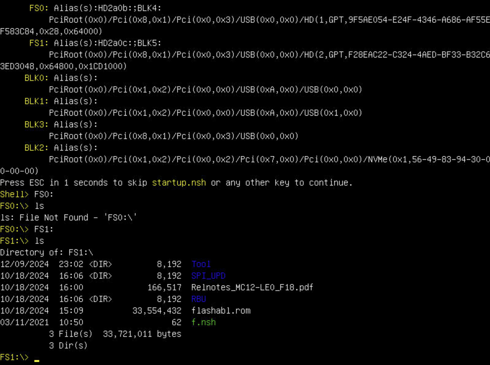

+++
title = "Updating the BIOS and BMC firmware on Gigabyte MC12-LE0" +++


Gigabyte MC12-LE0 is an microATX AMD AM4 motherboard based on the B550 chipset.

It has two PCIe 4.0 slots, 6 SATA slots, 6 (!) PWM fan connectors, and features an
ASPEED KVM, which lets you control the motherboard remotely.
It's also fairly inexpensive on the used market.

The catch? Its BIOS update process.

## Prerequisites

You can find the latest BMC firmware [here](https://www.gigabyte.com/us/Enterprise/Server-Motherboard/MC12-LE0-rev-1x#Support-Firmware),
and the latest BIOS version [here](https://www.gigabyte.com/us/Enterprise/Server-Motherboard/MC12-LE0-rev-1x#Support-Bios).

You'll need both regardless of the update method.

In order to update the BIOS, you will also need a working CPU that is already recognized by the motherboard.
The BIOS chip is only exposed to the BMC once the CPU is initialized and the system has POSTed, so you
can't flash the BIOS with no CPU installed, like on some other AM4 motherboards.

## The Good

I'd like to preface by saying that on some BMC and BIOS versions,
updating the firmware using BMC just works (tm) with no issues
whatsoever. So I would encourage you to try and update your
motherboard this way first.


Open the BMC's WebUI, and log in with your credentials. The default login is
`admin`, and the password is a part of the motherboard's serial number after the slash.

For example, if your motherboard's serial number is `4/I/DK3I5 456864`, the password is `DK3I5456864`.
The serial number can be found on a sticker in the middle of the motherboard.

After logging in, go to Maintenance > Firmware Update, and click on "Browse...".

Here, you'll want to select the RBU file (RBU/image.rbu) from the **BIOS archive** (not the BMC one).

After selecting the file, click on Start Firmware Update. You will be prompted to select the component to update.


Select "BMC". You can additionally choose to preserve either the whole BMC configuration, or single configuration items
(e.g. networking, authentication, etc.).

Finally, scroll to the bottom of the page and click on "Proceed to Flash".


Well that didn't seem to work.

However, if you're reading this article, chances are, you've already seen this message, and you've seen it coming.

Luckily, this is not the only way to update the BMC/BIOS firmware.

## The Bad

Our backup strategy involves using the UEFI shell to perform the updates.

For that, you'll want to copy the contents of the BMC firwmare archive to a
flash drive (formatted as FAT32), and plug the drive it into the motherboard.


Power on the motherboard, either using the case button, or the BMC's WebUI.

In the WebUI, go to Remote Control > Launch H5 Viewer. If you don't have any bootable device installed,
you should already be seeing the UEFI Shell. If not, you can reboot the server, enter the BIOS settings
and choose the UEFI Shell boot override.


Once you are in the UEFI Shell, take a look at the file systems available. In my case, there's FS0 and FS1.

Type `FS0:`, press Enter, and then type `ls`. This will list the contents of the file system. Repeat with all
available file system until you see the BMC firmware files.


Now, type "bmc" and press Tab to autocomplete the command until you see `bmc_fw_update_uefi.nsh`.
Press Enter to start the BMC firmware update process.

Once the update has started, the WebUI will stop responding. Be patient, and wait for the BMC to become available
on the same IP address. Keep in mind that if you chose not to preserve the settings, the motherboard will automatically
grab an IP address from your router using DHCP.

And after a few minutes, we're back in business!


It's time for the BIOS update.

## The Ugly

For some reason, the BIOS archive from the Gigabyte's website is missing
the UEFI executable needed to flash the BIOS from the UEFI shell (SPI_UPD/AfuEfix64.efi).


However, there's no need to scour the shady darknet sites for a version of the executable.

Looking at the contents of the BIOS archive, we can see that it includes _yet another_
archive inside with a "zi\_" extension.


Once we rename it to "zip" and unpack it, it appears to be an identical copy of the
main archive.

However, lo and behold, this copy _does_ actually include the necessary executable to update the BIOS!


To avoid confusion, make sure to only copy the contents of the "inside" archive to the flash drive,
but not before removing the BMC firmware files from it first.

The rest is identical to the BMC update process – plug the USB drive into the motherboard,
enter the UEFI shell, select the FS containing the update files (FS1: in my case).



Once you've found the update files, type `f.nsh`, and press Enter.

You may see the following error:

```
THE ROM file information does not match the system BIOS
```

If that's the case, select the option "E" (Update Entire BIOS Region and Exit)
when prompted.

After the update is finished, the motherboard should reboot on its own. However, some users over at the STH forum
report that their motherboard got stuck with no output after the process was finished. If that's the case for you,
wait for ~30 minutes and reboot the board manually.

Great Success!

