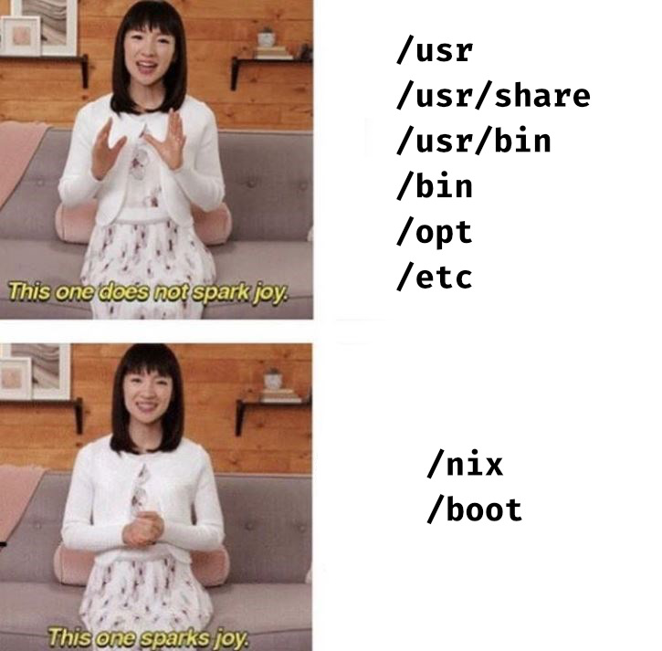

+++
title = "Ephemeral root partition on NixOS using ZFS" +++



## What is 'ephemeral root'?

Ephemeral root (also "opt-in state", immutable root or
[Erase your darlings](https://grahamc.com/blog/erase-your-darlings/))
is a root parition setup in which the filesystem root is erased on
every system boot.
We can then manually "opt in" directories which we want to preserve accross reboots.

## Why would I want that?

Even if you use IaC for your machines, over time, most systems accumulate
garbage state – be that through the user themselves (e.g. files like
`very_important_script123.sh` in random places on the drive) or through
third-party software.

Some systems also require manual steps/workarounds even after provisioning them
using IaC. These steps often stay undocumented and become forgotten until the
next reinstall.

Ephemeral root setup disciplines the operator to eliminate those workarounds and
forces them to develop better, more robust IaC.

Besides, it feels good to know that your system has no leftover/unnecessary state
and only the things that are truly necessary are persisted.

## How does it work?

In a regular UNIX-like system, packages and configuration files are installed
into directories like /usr/share, /usr/local, /bin, /opt or /etc.
Removing most of these directories effectively breaks your system.

NixOS, on the other hand, keeps most of the installed packages and configuration
files in the Nix store (/nix). These are then symlinked into the usual
FHS directories, like /bin and /etc, on every boot.

In theory, this makes it possible to boot NixOS with only two
directories present – /nix and /boot.

We can then create separate ZFS datasets for these and other
directories which we want to preserve across reboots
(e.g. `/var/log/`, `/var/lib` and `home`).

As for erasing the rest of the files/folders on every boot –
this is made possible by using ZFS snapshots. Once we create a
ZFS dataset for the root partition (`/`), we can immediately
make an empty snapshot of it, and then write a systemd service
that resets our root filesystem to that snapshot.

## Creating and formatting ZFS datasets

The relevant filesystems can be created using [disko](https://github.com/nix-community/disko).

In particular, disko can automatically run shell commands after creating ZFS
datasets using `postCreateHook`:

```nix
{
  disko.devices = {
    zpool = {
      rpool = {
        datasets = {
          "nixos/empty" = {
            type = "zfs_fs";
            options.mountpoint = "legacy";
            mountpoint = "/";
            postCreateHook = "zfs snapshot rpool/nixos/empty@start";
          };
        };
      };
    };
  };
}
```

We can then create other datasets for data which we want to preserve across reboots:

```nix
{
  disko.devices = {
    zpool = {
      rpool = {
        datasets = {
          nixos = {
            type = "zfs_fs";
            options.mountpoint = "none";
          };
          "nixos/var" = {
            type = "zfs_fs";
            options.mountpoint = "none";
          };
          "nixos/var/log" = {
            type = "zfs_fs";
            options.mountpoint = "legacy";
            mountpoint = "/var/log";
          };
          "nixos/var/lib" = {
            type = "zfs_fs";
            options.mountpoint = "legacy";
            mountpoint = "/var/lib";
          };
          "nixos/nix" = {
            type = "zfs_fs";
            options.mountpoint = "legacy";
            mountpoint = "/nix";
          };
          "nixos/config" = {
            type = "zfs_fs";
            options.mountpoint = "legacy";
            mountpoint = "/etc/nixos";
          };
        };
      };
    };
  };
}
```

The full code for the disko configuration (assuming a single ZFS drive and EFI) can be found
[in my nix-config repository on Github](https://github.com/notthebee/nix-config/blob/main/machines/nixos/aria/disko.nix)

After booting into the NixOS live ISO, we can then download the disko file using curl, and replace the disk variable with the ID of our boot drive (as seen in `/dev/disk/by-id`):

```bash
curl https://github.com/notthebee/nix-config/raw/refs/heads/main/machines/nixos/aria/disko.nix -o /tmp/disko.nix
sed -i "s|builtins.head config.zfs-root.bootDevices|nvme-PC601_NVMe_SK_hynix_256GB_AI97N00681CA38E2W|" /tmp/disko.nix
```

Finally, we can format the boot drive and mount the file systems relative to /mnt:

```bash
nix --experimental-features "nix-command flakes" run github:nix-community/disko \
    -- -m destroy,format,mount /tmp/disko.nix
```

## NixOS configuration

The OS configuration itself is relatively simple.

We declare our ZFS datasets and their respective mountpoints:

```nix
{
  fileSystems."/" = lib.mkForce {
    device = "rpool/nixos/empty";
    fsType = "zfs";
  };

  fileSystems."/nix" = {
    device = "rpool/nixos/nix";
    fsType = "zfs";
    neededForBoot = true;
  };

  fileSystems."/etc/nixos" = {
    device = "rpool/nixos/config";
    fsType = "zfs";
    neededForBoot = true;
  };

  fileSystems."/boot" = {
    device = "bpool/nixos/root";
    fsType = "zfs";
  };

  fileSystems."/var/log" = {
    device = "rpool/nixos/var/log";
    fsType = "zfs";
    neededForBoot = true;
  };

  fileSystems."/var/lib" = {
    device = "rpool/nixos/var/lib";
    fsType = "zfs";
    neededForBoot = true;
  };
}
```

We will also need to enable systemd in initrd, and declare a systemd service
that takes care of resetting our root filesystem to a blank slate on every boot:

```nix
{
  boot.initrd.systemd = {
    enable = true;
    services.initrd-rollback-root = {
      after = [ "zfs-import-rpool.service" ];
      wantedBy = [ "initrd.target" ];
      before = [
        "sysroot.mount"
      ];
      path = [ pkgs.zfs ];
      description = "Rollback root fs";
      unitConfig.DefaultDependencies = "no";
      serviceConfig.Type = "oneshot";
      script = "zfs rollback -r rpool/nixos/empty@start";
    };
  };
}
```

## Credits

This post is largely inspired by Graham Christensen's
[Erase your darlings](https://grahamc.com/blog/erase-your-darlings/) post.

However, Graham's post, as well as many other tutorials/posts which cover the topic,
use `boot.initrd.postDeviceCommands` for ZFS rollback on boot,
which [isn't supported when using systemd in stage 1](https://github.com/NixOS/nixpkgs/blob/7046248e4f0acb90b47cc4336203eb810293e147/nixos/modules/system/boot/systemd/initrd.nix#L403).

Since I need systemd in stage 1 due to MergerFS shenanigans,
I've decided to write my own post that includes a systemd implementaion
of the rollback script.
